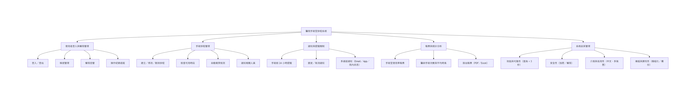
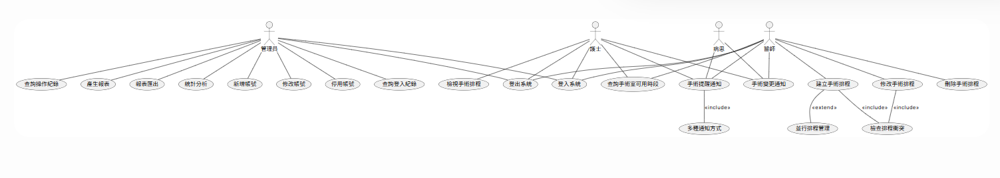

# 🏥 HW3：台中仁愛醫院手術室排程規劃

## 一、功能性需求（Functional Requirements）

### 1. 使用者身分與權限管理 (User & Role Management)
- 系統必須提供**登入**與**登出**功能，並根據**使用者身分**（醫師、護士、管理員）給予相對應權限。  
- 管理員必須能**新增**、**修改**與**停用**使用者帳號。  
- 系統必須**記錄**每次使用者**登入時間**與**操作紀錄**，以利**追蹤**與**稽核**。  

### 2. 手術排程管理 (Surgery Scheduling Management)
- 系統必須允許醫師**建立**、**修改**與**刪除**手術排程。  
- 系統必須**自動檢查**手術室與醫療人員的可用時段，**避免排程衝突**。  
- 系統必須**支援**多手術室、多醫師**並行**的排程管理模式。  
- 系統必須在排程**變更**時，**自動通知相關醫護人員**與**病患**。  

### 3. 通知與提醒機制 (Notification & Reminder System)
- 系統必須在**手術前 24 小時自動提醒相關人員**與**病患**。  
- 系統必須**即時發送**手術時間**變更**或**取消**的通知。  
- 系統應**支援多種通知方式**（Email、APP 推播、院內系統訊息）。  

### 4. 報表與統計分析 (Reports & Analytics)
- 系統必須能**產生每日**、**每週**與**每月**的手術室**使用率報表**。  
- 系統必須**提供醫師個人手術次數**與**平均時長統計**。  
- 系統應支援**將報表匯出**為 **PDF** 或 **Excel** 格式。  

---

## 二、非功能性需求（Non-Functional Requirements）

### 1. 效能與可靠性 (Performance & Reliability)
- **系統查詢**與**排程回應時間不得超過3秒**。  
- 系統必須**具備99%以上的可用**（Uptime）。  
- 系統資料庫須**每日自動備份**，**確保資料不遺失**。  

### 2. 安全性 (Security)
- 系統必須**遵守醫療資料安全法規**（如 HIPAA 或個資法）。  
- 所有**登入**與**資料傳輸**必須**使用加密通訊**（HTTPS / SSL）。  
- 系統必須**具備權限控管**與**操作紀錄功能**，以**防未授權存取**。
  
### 3. 使用介面與可用性 (Usability)
- 系統介面設計必須**簡潔易懂**，醫師與護士能在**最少步驟內完成操作**。  
- 系統應**支援桌面與平板裝置使用**，並能自**適應不同螢幕大小**。  
- 系統必須**支援繁體中文介面**。  

### 4. 維護與擴充性 (Maintainability & Scalability)
- 系統架構**應模組化**，方便未來**新增功能或改版**。  
- 系統程式碼需具備**良好註解**，以利**維護與除錯**。  
- 系統應能因應**手術量增加**而**保持穩定效能**。  

---

## 🩺 手術室排程功能分解圖(functional decomposition diagram)

---

## 🩺 手術室排程案例使用圖(use case diagram)

---

## 案例說明

### 管理員案例

| 使用案例名稱 | 帳號權限管理             |
|--------------|-----------------|
| 行動者       | 管理員                  |
| 說明         | 負責新增、修改及停用系統帳號，並分配使用權限           |
| 完成動作     | 1. 建立新帳號 2. 調整使用者權限 3. 停用不需要的帳號  |
| 替代方法     | 1. 發現重複帳號時修改資料 2. 權限設定錯誤時重新分配 |
| 先決條件     | 已登入系統並有管理員權限       |
| 後置條件     | 帳號與權限設定完成，系統可正常接受新使用者運作 |
| 假設         | 必須有管理員身份和權限         |

### 醫師案例

| 使用案例名稱 | 手術排程管理                   |
|--------------|------------------------------|
| 行動者       | 醫師                         |
| 說明         | 負責建立、修改手術排程，並處理排程衝突與通知           |
| 完成動作     | 1. 開始建立手術排程 2. 檢查手術室和人員可用時段 3. 成功建立或變更手術排程 |
| 替代方法     | 1. 排程衝突時系統提示重新選擇 2. 取消或更改手術時間 |
| 先決條件     | 醫師已登入且擁有排程權限           |
| 後置條件     | 排程完成後，通知相關人員和病患      |
| 假設         | 已有足夠手術室與醫療人力可排程      |

### 護士案例

| 使用案例名稱 | 手術排程查詢與通知               |
|--------------|-------------------------------|
| 行動者       | 護士                          |
| 說明         | 護士登入系統後，能夠查詢即將進行的手術排程，並接收手術通知或異動提醒 |
| 完成動作     | 1. 查詢手術排程 2. 接收系統手術提醒/變更通知               |
| 替代方法     | 1. 查詢失敗時重新操作 2. 通知未收到時可重發                  |
| 先決條件     | 護士已登入系統，並有查詢權限                        |
| 後置條件     | 護士了解最新手術排程並可因應安排                       |
| 假設         | 系統內有完整手術排程資料及正確聯絡資訊                 |

### 病患案例

| 使用案例名稱 | 排程及通知查詢                   |
|--------------|------------------------------|
| 行動者       | 病患                         |
| 說明         | 接收手術前提醒與異動通知 |
| 完成動作     | 1. 接收手術24小時前提醒 2. 接收排程異動通知 |
| 替代方法     | 1. 未收到通知時系統自動重發 2. 病患重新登錄查詢 |
| 先決條件     | 已安排手術排程                   |
| 後置條件     | 已取得所有最新通知               |
| 假設         | 基本聯絡資料正確、排程資料已記錄     |

