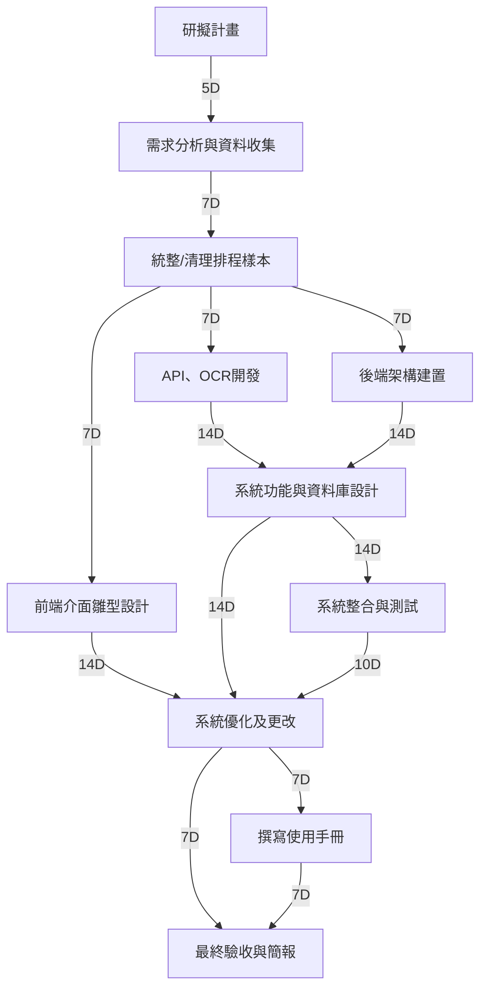

# 第8組 台中仁愛醫院手術室排程規劃
專案期間：2025/10/01 ～ 2025/12/21  
小組人數：4（前端、後端、資料分析）  
  

---

## 1. 小組成員與分工
| 成員 | 角色 | 任務內容 |
|------|------|----------|
|李家丞| 前端 | UI/UX設計、介面設計，手術排程 |
|王奕翔、陳人豪 | 後端 | API開發、資料庫設計、OCR技術開發 |
|廖村浩 | 資料分析 | 統整/清理排程樣本、數據處理、撰寫使用手冊 |

---

## 2. 工作分解結構 (WBS)
| 編號 | 任務說明 | 需時 (天) | 前置任務 | 負責成員 |
|------|----------|-----------|-----------|----------|
| 1 | 研擬計畫 | 5 | - | 全員 |
| 2 | 需求分析與資料收集 | 7 | 1 | 全員 |
| 3 | 統整/清理排程樣本 | 7 | 2 | C |
| 4 | API、OCR開發 | 14 | 3 | B |
| 5 | 後端架構建置 | 14 | 3 | B |
| 6 | 前端介面雛型設計 | 14 | 3 | A |
| 7 | 系統功能與資料庫設計 | 14 | 4,5 | B |
| 8 | 系統整合與測試 | 10 | 7 | 全員 |
| 9 | 系統優化及更改 | 7 | 6,7,8 | A,B |
| 10 | 撰寫使用手冊 | 7 | 9 | C |
| 11 | 最終驗收與簡報 | 7 | 9,10 | 全員 |

---

## 3. PERT/CPM 圖

---

